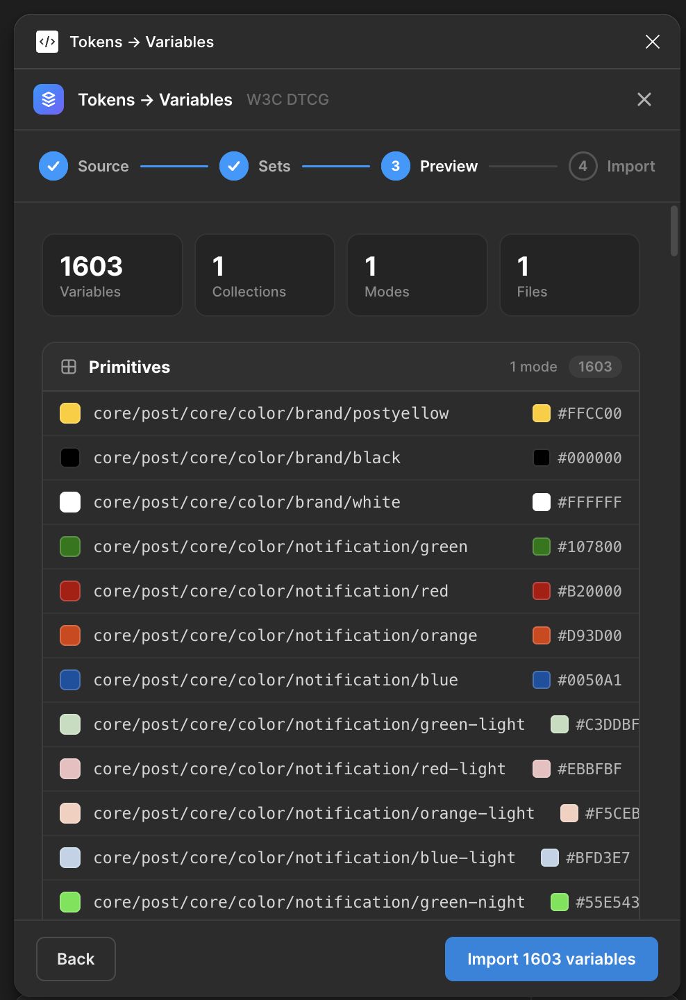
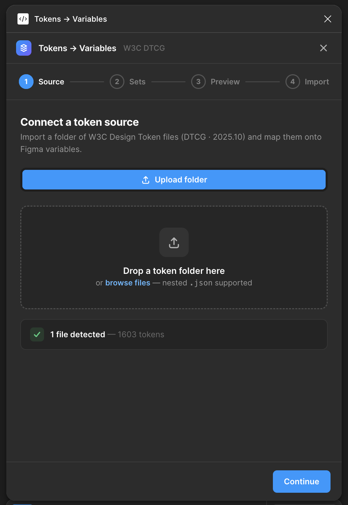

# Boppli — Tokens → Variables

A Figma plugin that imports **W3C Design Tokens (DTCG · 2025.10)** from a
folder of JSON files and creates the matching **Figma variables** in your
file — preserving names, groupings, and types.

The MVP focuses on a deterministic, auditable path from token JSON to
Figma. No editing tokens in Figma, no cloud sync, no telemetry.

---

## Screenshots

| Step 1 — Source | Step 3 — Preview |
|---|---|
|  |  |

---

## Features

- **Folder upload** — drop a folder of `.json` files, or use the system
  picker. Nested folders are walked automatically.
- **W3C DTCG · 2025.10 parser** — handles `$type` of `color`,
  `dimension`, and `number`. Unsupported types are surfaced as console
  warnings, never silently dropped.
- **Four-step guided flow** — Source → Sets → Preview → Import. Step 3
  shows exactly what will be created before any Figma mutation happens.
- **Idempotent re-runs** — re-importing the same tokens updates the
  existing variables in place rather than creating duplicates.
- **Single Primitives collection (MVP)** — every token lands in a
  collection named `Primitives` with one mode named `Value`. Color
  tokens become `COLOR` variables; dimensions and numbers become
  `FLOAT` variables.
- **Live progress + console** — Step 4 streams progress and a
  per-operation log, so a failed import tells you which token in which
  file went wrong.
- **Zero network access** — the MVP manifest declares
  `networkAccess: ["none"]`. Nothing leaves Figma.

### Added in M2 + M4

- **Aliases** — `{color.blue.500}` references are resolved across files.
  The settings sheet's *Reference handling* control switches between
  **Keep as alias** (Figma variable-to-variable alias edges, preserving
  the author's direct hop) and **Resolve to raw value** (substitute the
  literal at the chain tip).
- **Themes → modes** — sibling files in the same directory whose token
  shapes match are folded into a single collection with one mode per
  file. `semantic/light.json` + `semantic/dark.json` become the
  `Semantic` collection with `Light` and `Dark` modes; alias edges are
  written per mode.
- **Three-collection layout** — `core/*` → **Primitives**,
  `semantic/*` → **Semantic**, `components/*` → **Components**. Unknown
  top-level folders fall back to Primitives with a warning.
- **Group separator** — emit variable names with `/` or `.` between
  groups (Figma renders both as nesting in the Variables panel).
- **Update-existing toggle** — when on, re-imports match by
  `(collection, name)` and overwrite values; when off, existing
  variables are preserved and the skip is logged per token.
- **Settings persistence** — every setting above is stored in Figma's
  `clientStorage` and re-loaded on plugin boot.

### Not in the MVP (planned)

The full roadmap is in [specs/constitution.md](specs/constitution.md) §2.
Notable **[planned]** items:

- GitLab source — connect to a self-hosted GitLab repo and pull tokens
  from a branch.

---

## Install (development)

The MVP is published as source. To run it in Figma desktop:

1. **Clone the repo.**
   ```sh
   git clone https://github.com/aibotwizard/boppli.git
   cd boppli/plugin
   ```
2. **Install dependencies.** Requires Node 18+.
   ```sh
   npm install
   ```
3. **Build the plugin bundle.** Produces `plugin/dist/code.js` and a
   single self-contained `plugin/dist/ui.html`.
   ```sh
   npm run build
   ```
   Or, for iterative development:
   ```sh
   npm run watch
   ```
4. **Load it in Figma desktop.**
   - Open Figma desktop (the web app cannot load dev plugins).
   - Menu → **Plugins → Development → Import plugin from manifest…**
   - Pick [`plugin/manifest.json`](plugin/manifest.json).

The plugin now appears under **Plugins → Development → Tokens → Variables**.

### Verify the build

```sh
cd plugin
npm test         # parser + mapping unit tests (vitest)
npm run typecheck
```

---

## Use

1. **Run the plugin** in any Figma file: **Plugins → Development →
   Tokens → Variables**.
2. **Step 1 — Source.** Click **browse files** (or drag a folder onto the
   drop zone) and select a folder containing your DTCG `.json` files.
   The plugin walks subfolders automatically.
3. **Step 2 — Sets.** Review the detected files, grouped by folder.
   Untick any files you don't want to import.
4. **Step 3 — Preview.** Inspect the variables that will be created.
   You'll see one row per token with its resolved value and a color
   swatch where applicable. Counts at the top tell you total variables,
   collections, modes, and source files.
5. **Step 4 — Import.** Click **Import N variables**. A progress bar
   and live console show each operation. When the import completes,
   the **Primitives** collection (or whichever exists) is populated in
   your Figma file's **Variables** panel.

### Re-importing

Re-running the plugin with the same token files updates existing
variables in place (matched by `(collection, name)`) — it does not
create duplicates. See [ADR-0004](specs/decisions/0004-idempotent-variable-upsert.md)
for the rationale.

### Supported token shape

The MVP supports W3C DTCG · 2025.10 with `$type` ∈ `{color, dimension,
number}`. Example:

```json
{
  "color": {
    "blue": {
      "500": { "$type": "color", "$value": "#0D99FF" }
    }
  },
  "space": {
    "200": { "$type": "dimension", "$value": 16 }
  }
}
```

Aliases (`{color.blue.500}`) are resolved across the upload. With
*Reference handling* set to **Keep as alias** the resulting Figma
variable carries an alias edge to its target; with **Resolve to raw
value** the literal at the chain tip is substituted.

---

## Project structure

```
boppli/
├── plugin/                  # The shipping plugin
│   ├── manifest.json
│   ├── build.mjs            # esbuild — bundles UI + sandbox + inlines HTML
│   ├── src/
│   │   ├── code/            # Sandboxed Figma side (calls figma.variables.*)
│   │   ├── ui/              # Iframe UI (HTML + CSS + TS)
│   │   └── shared/          # DTCG parser + mapping → variable plan
│   └── tests/               # vitest unit tests + DTCG fixtures
├── specs/                   # Constitution, plan, ADRs, agents
│   ├── constitution.md
│   ├── plan.md
│   ├── decisions/           # ADRs 0001–0008
│   ├── agents/              # AO / UX / PO agent definitions
│   ├── assets/              # Design source (HTML/CSS/JS prototype)
│   └── requirements/        # User-facing requirements (req-0001.md)
└── docs/
    └── images/              # README screenshots
```

---

## Documentation

- **Mission, roadmap, validation gates** —
  [specs/constitution.md](specs/constitution.md)
- **Implementation plan** — [specs/plan.md](specs/plan.md)
- **Architecture decisions** —
  [specs/decisions/](specs/decisions/) (8 ADRs, indexed in the README)
- **Team agents** — [specs/agents/](specs/agents/) (AO, UX, PO)
- **Original requirement** —
  [specs/requirements/req-0001.md](specs/requirements/req-0001.md)
- **Design source of truth** —
  [`specs/assets/figma-design-tokens-plugin/project/Tokens to Variables.dc.html`](specs/assets/figma-design-tokens-plugin/project/Tokens%20to%20Variables.dc.html)

---

## License

Not yet specified.
